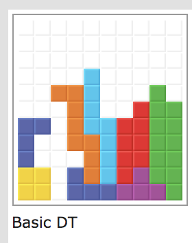

*Here's a little picture of my favorite tetris opening.*\

# PROJECT: FILLIT
C project: write a program that reads a file of tetrominos, then output them (without rotations) with a least amount of empty spaces. There are multiple solutions; however, pieces are prioritized top left based on the order coming from the file. Refer to [pdf][pdf] for more details.

[pdf]:https://github.com/nkone/Fillit/blob/master/fillit.pdf

**Sample file**
>.\.\.#\
>.\.\.#\
>.\.\.#\
>.\.\.#
>
>\##.\.\
>\##.\.\
>.\.\.\.\
>.\.\.\.

**Output**
>ABB\.\
>ABB\.\
>A.\.\.\
>A.\.\.

## Table of Contents
<!--ts-->
* [How to use](#how-to-use)
* [Project Mandatory](#project-mandatory)
* [Algorithm](#algorithm)
* [Details](#details)
  * [Validation](#validation)
<!--te-->

### How to use
```
git clone https://github.com/nkone/Fillit
make
```
After make, run the binary executable called fillit like so
```
./fillit sourcefile
```
If a sourcefile is invalid, the program will display error.

>./fillit sample | cat -e
>Error

Make sure the each piece in the file, except the last piece, is followed by a newline. There can't be other characters, except **'.'** and **'#'**. Each tetromino must be valid. Refer to [sample.txt][sample].

[sample]:https://github.com/nkone/Fillit/blob/master/sample.txt

### Project Mandatory
For projects written in C, students at 42 must follow [Norm][norm] standard for 42SiliconValley.

Functions allowed: **open**, **close**, **exit**, **read**, **write**, **malloc**, and **free**.


[norm]:https://github.com/nkone/Fillit/blob/master/norme.en.pdf

### Algorithm
I broke this project up into multiple steps:
1. Check if the file is valid.
2. Store the **'#'** as an integer array.
3. Shift the pieces.
4. Store the pieces in a linked list.
5. Backtracking.

### Details
#### Validation
For validation, I read in the file twice since reread function is forbidden.

The first time I read, I checked for number of #'s, extra newlines, extra spaces, whether the piece is a block of 4 lines, or invalid characters. The second time, I collect the pieces as an integer array and use it to compare with my macro [table][table] in my header file. Even though I collected them as integer arrays and shift them top left, I append to my linked list as literal strings matching my macro names. Reason for that is, I want a return NULL if the comparsion returns *false*. If NULL then my program will exit and output "Error". I wasn't sure at that time if there was a better method. If you use this program as reference, you can make it faster if you can shorten this conversion part. After I got the strings, I convert them back to integer arrays ¯\_(ツ)_/¯. You can find my comparison function **get_id()** and **convert_id()** in [*tab_trans.c*][shift].

#### Shifting
Shifting is not that hard, look for *min_x* and *min_y* then subtract them from the integer array of each piece. By doing that all the pieces will move to top left of the board. I also make a separate function called **shift_tet()** for backtracking. It takes in an integer array and shift (*x,y*) (located in [*tab_trans.c*][shift]).

### Linked list
My linked list has three variables (a void pointer, a char, and a pointer to next node of the list). See my [header][table].
In order to store them, I made two functions **add_piece()** and **append()**. The function *add_piece()* does exactly what it says, add a piece. Since I use a void pointer for my main data, I can point it to an integer array or a string, making it possible for two separate data types. A character (*char c*) is used for identification of the order of the piece. First piece gets 'A'. Second is 'B' and so on. However, because of the structure of linked list, I need the function *append()* to traverse to the end of the list and add a piece there. Most of the structure related functions are located in [*stack.c*][stack]. Most of the linked list structure I learn is from [zentut][zentut].

### Collision
To check for collision, I find the highest x and y in the integer array, then use them to check against the grid I made to work with. Since the grid has a certain size, if any of the number in the array is same as the size then the piece is out of bound. **box_collide()** takes in an integer array and the size of the grid and returns 1 if the piece is out of bound. Not only that but, I also have to check if the piece collide with other pieces on the grid. **piece_collide**() takes in an integer array and the grid I'm working with and use the coordinates in the array to find *'.'* characters on the grid. If the there is a none '.' character it will return 1. One thing to notice is that, I have to check for box collision first before piece collision; otherwise, I'd run into segfault error since I go outside of the grid range. You can see [*collision.c*][collision] to see how I did it.

### 

[table]:https://github.com/nkone/Fillit/blob/master/includes/fillit.h
[shift]:https://github.com/nkone/Fillit/blob/master/srcs/tab_trans.c
[stack]:https://github.com/nkone/Fillit/blob/master/srcs/stack.c
[collision]:https://github.com/nkone/Fillit/blob/master/srcs/collision.c
[zentut]:http://www.zentut.com/c-tutorial/c-linked-list/
